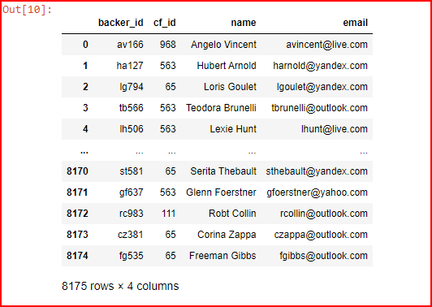
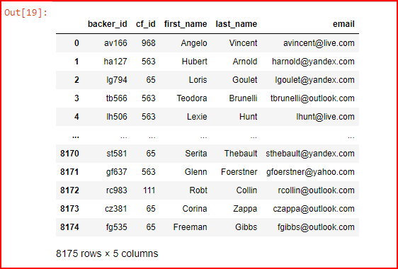

# Crowdfunding ETL

## Overview

Independent Funding is a crowd-funding platform that provides financial support for independent projects and ventures. The platform has recently experienced growth, prompting the need to migrate its data from a large Excel file to a PostgreSQL database. This change will enable the analytics team to conduct data analysis and produce reports for stakeholders and donors alike. As part of this initiative, Junior SQL Developer Britta has been assigned several key tasks. These include extracting and transforming data from the Excel file into four CSV files, creating a PostgreSQL database with corresponding tables using an Entity-Relationship Diagram (ERD), loading the CSV files into the database, and performing SQL queries to generate reports.

## Resources

1. Python version 3.6.8
2. Jupiter Notebook 6.5.2
3. Anaconda 2.3.1
5. PostgreSQL v.15
6. PgAdmin

## Schema

## Extract Data

## Transform and Clean Data

## Load Data

## SQL Analysis

